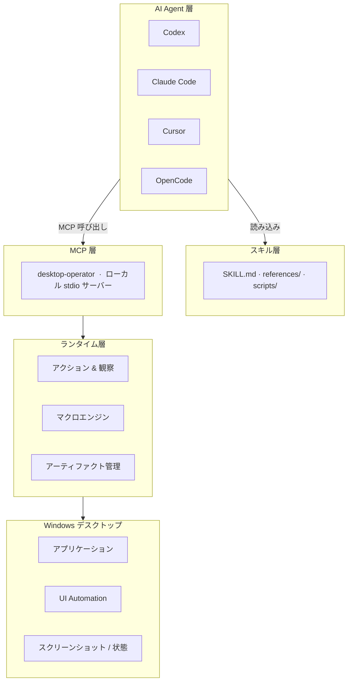

<div align="center">


<br/>

[](https://github.com/Marways7/cua_desktop_operator_skill)

<br/>


<br/>

[](#)
[](#)
[](#)
[](./LICENSE)
[](#)

<br/>

<p>
  <a href="./README.md"></a>
  <a href="./README.zh-CN.md"></a>
  <a href="./README.zh-Hant.md"></a>
  <a href="./README.ja.md"></a>
  <a href="./README.ko.md"></a>
</p>

</div>

---

## プロジェクト概要

`CUA Desktop Operator Skill` は、MCP 対応のすべての AI Agent に対して構造化された Windows デスクトップ操作能力を提供する**スタンドアロンのクローン即使用可能なスキルリポジトリ**です。

リポジトリのルートディレクトリ**そのもの**がスキルパッケージです——Agent の skills ディレクトリにクローンするだけで即座に使用できます。

```
agent（Codex / Claude Code / Cursor / OpenCode / ...）
    └─► MCP クライアント
            └─► desktop-operator（ローカル stdio サーバー、このリポジトリ）
                     └─► Windows デスクトップ
```

---

## なぜこのプロジェクトが必要か

現在のデスクトップ自動化スタックのほとんどは、二つの極端などちらかに偏っています：

| アプローチ | 問題点 |
|---|---|
| 脆弱なスクリプト | 構造化された観察モデルがない；UI が少し変わるだけで壊れる |
| 重量級 Agent システム | 固定されたモデルバックエンド、クラウドプランナー、または専有ビジュアルスタックに依存 |

**CUA Desktop Operator は異なるアプローチを取ります：**

| 設計原則 | 意味 |
|---|---|
| 推論は Agent 側に残す | AI モデルが判断し、このスキルは実行するだけ |
| 実行はローカルに残す | クラウドへの往復なし、外部ビジュアルモデル不要 |
| インターフェースは統一 | MCP ツールはすべての Agent で完全に同一 |
| スキルはポータブル | 一度クローンすれば Codex、Claude Code、Cursor で即使用可能 |

結果として、各クライアントのために実行レイヤーを再構築することなく、複数の AI クライアントで再利用できる実用的なデスクトップオペレーターが実現します。

---

## コア機能

<table>
<tr>
<td width="50%" valign="top">

### デスクトップ制御
- アプリケーションの起動
- タイトルまたはインデックスによるウィンドウフォーカス
- 絶対座標またはウィンドウ相対座標でのクリック
- ホットキーとキーシーケンスの送信
- テキストの入力と貼り付け（CJK 対応クリップボードモード）
- スクロールと明示的な待機

</td>
<td width="50%" valign="top">

### 観察優先ワークフロー
- フルスクリーンショットのキャプチャ
- アクティブウィンドウの検出
- 表示中ウィンドウの一覧
- ターゲットウィンドウのクロップ画像
- 有界 UI Automation クエリ
- 構造化 JSON 状態アーティファクト

</td>
</tr>
<tr>
<td width="50%" valign="top">

### 再利用可能なマクロレイヤー
- アプリ起動（コマンド、URI、ショートカット）
- 検索ボックスの送信
- チャットパネルのトグル
- メディア再生/一時停止
- ブラウザのアドレスバーフォーカス
- Windows 設定を開く
- 送信/確認操作

</td>
<td width="50%" valign="top">

### クロス Agent インターフェース
- Codex
- Claude Code
- Cursor
- OpenCode
- 手動 stdio 設定による任意の MCP 対応 Agent
- Agent 中立：同一ツール、同一結果、任意のクライアント

</td>
</tr>
</table>

---

## アーキテクチャ



### 各層の責務

| 層 | 役割 |
|---|---|
| **スキル層** | このスキルをいつ・どのように使うかを Agent に伝える；観察→計画→実行→検証のループを定義；クライアント設定ガイドを提供 |
| **MCP 層** | stdio を通じて安定したバージョン管理されたツールインターフェースを公開；すべてのクライアントに一貫した結果を返す |
| **ランタイム層** | Win32 / UI Automation を通じて実際のデスクトップ操作を実行；スクリーンショットとウィンドウ状態をキャプチャ；アーティファクトのライフサイクルを管理 |

---

## リポジトリ構成

```text
cua_desktop_operator_skill/
├── SKILL.md                          ← Agent が最初に読むファイル
├── README.md                         ← 英語ドキュメント
├── README.zh-CN.md                   ← 簡体字中国語
├── README.zh-Hant.md                  ← 繁体字中国語
├── README.ja.md                      ← 日本語
├── README.ko.md                      ← 韓国語
├── LICENSE                           ← GNU AGPL v3.0
├── SECURITY.md
├── agents/
│   └── openai.yaml                   ← Agent マニフェスト（Codex / OpenCode）
├── references/
│   ├── compatibility.md              ← クロス Agent 互換性ノート
│   ├── failure-recovery.md           ← 障害復旧パターン
│   ├── interaction-patterns.md       ← インタラクションのベストプラクティス
│   ├── macro-catalog.md              ← 組み込みマクロリファレンス
│   ├── mcp-client-setup.md           ← クライアント設定ガイド
│   └── mcp-tool-catalog.md           ← 完全な MCP ツールリファレンス
├── scripts/
│   ├── setup_runtime.ps1             ← 依存関係のインストール
│   ├── start_mcp_server.ps1          ← MCP サーバーの起動
│   ├── verify_real_tasks.ps1         ← エンドツーエンドのスキル検証
│   └── verify_real_tasks.py
├── desktop_operator_core/            ← ランタイムライブラリ
└── desktop_operator_mcp/             ← MCP サーバーパッケージ
```

---

## クイックスタート

### ステップ 1 — skills ディレクトリにクローン

```powershell
# Codex の場合
git clone https://github.com/Marways7/cua_desktop_operator_skill "$HOME\.codex\skills\cua_desktop_operator_skill"

# Claude Code の場合
git clone https://github.com/Marways7/cua_desktop_operator_skill "$HOME\.claude\skills\cua_desktop_operator_skill"

# Cursor の場合
git clone https://github.com/Marways7/cua_desktop_operator_skill "$HOME\.cursor\skills\cua_desktop_operator_skill"
```

### ステップ 2 — 依存関係のインストール

```powershell
.\scripts\setup_runtime.ps1
```

### ステップ 3 — ローカル MCP サーバーの起動

```powershell
.\scripts\start_mcp_server.ps1
```

### ステップ 4 — Agent に SKILL.md を読ませる

リポジトリルートの `SKILL.md` を Agent に指示します。Agent はそのファイルを読み込み、**自動的に自身を設定**します——利用可能なツール、推奨ワークフロー、ローカル MCP サーバーへの接続方法を理解します。

手動での MCP 設定は不要です。スキルファイル自体が完全な自己記述型ドキュメントです。

---

## MCP ツールリファレンス

### 観察ツール

| ツール | 説明 |
|---|---|
| `desktop_observe` | フルスクリーンショット、アクティブウィンドウ、ウィンドウリスト、オプションのターゲットウィンドウクロップ画像、JSON 状態アーティファクトをキャプチャ |
| `desktop_get_last_artifacts` | 最新のスクリーンショット、状態、実行、失敗アーティファクトのパスを読み込む |
| `desktop_cleanup_artifacts` | タスク成功完了後にタスクスコープの一時ファイルを削除 |

### ウィンドウ管理

| ツール | 説明 |
|---|---|
| `desktop_list_windows` | すべての表示中ウィンドウのクイックインベントリ |
| `desktop_find_window` | タイトルフィルターで候補ウィンドウを検索 |
| `desktop_focus_window` | キーボード操作の前にウィンドウを前面に持ってくる |
| `desktop_launch_app` | シェルコマンド、実行ファイル、URI、またはショートカットを起動 |

### プリミティブアクション

| ツール | 使用場面 |
|---|---|
| `desktop_click_relative` | **推奨** — ターゲットウィンドウ相対位置でのクリック |
| `desktop_click_absolute` | 最終手段 — 絶対スクリーン座標でのクリック |
| `desktop_send_keys` | 単一キーまたはホットキーシーケンス（`Ctrl+C`、`Alt+F4` など） |
| `desktop_type_text` | 短い純粋な ASCII テキスト |
| `desktop_paste_text` | **CJK または長いテキストに推奨** — クリップボードバックの貼り付け |
| `desktop_scroll` | フォーカスされたエリアをスクロール |
| `desktop_wait` | UI 読み込み中の明示的な待機 |

### UI Automation ツール

| ツール | 説明 |
|---|---|
| `desktop_uia_query` | オプションのセレクター（テキスト、Automation ID、コントロールタイプ）で UIA コントロールを列挙 |
| `desktop_uia_click` | テキスト、Automation ID、またはコントロールタイプで UIA コントロールをクリック |
| `desktop_uia_type` | UIA コントロールにフォーカスしてテキストを入力 |

### ワークフロータール

| ツール | 説明 |
|---|---|
| `desktop_run_macro` | 組み込みマクロを実行；`macro_id="__catalog__"` で全マクロを一覧表示 |
| `desktop_validate_state` | アクション後にウィンドウまたはコントロールが存在することを検証 |

詳細な説明：[`references/mcp-tool-catalog.md`](./references/mcp-tool-catalog.md)

---

## マクロカタログ

マクロは安定した再利用可能な GUI 操作パターンをカプセル化します。既知のフローにはプリミティブより優先してマクロを使用してください。

| マクロ ID | カテゴリ | 目的 |
|---|---|---|
| `app_launch` | アプリ起動 | コマンド、URI、または実行ファイルでアプリを起動 |
| `desktop_shortcut_launch` | アプリ起動 | `.lnk` ショートカットパスで起動 |
| `search_box_submit` | 検索 | 検索ボックスにフォーカス、クエリを入力、送信 |
| `chat_panel_toggle` | チャット | ホットキーまたは相対クリックでチャットパネルをトグル |
| `media_play_pause` | メディア | メディアプレーヤーに再生/一時停止キーを送信 |
| `browser_focus_address_bar` | ブラウザ | ショートカットでブラウザのアドレスバーにフォーカス |
| `submit_or_confirm` | 確認 | 送信/確認キーシーケンスを押す |
| `open_windows_settings` | 設定 | Windows 設定アプリを開く |

詳細な説明：[`references/macro-catalog.md`](./references/macro-catalog.md)

---

## 設計原則

| 原則 | 詳細 |
|---|---|
| **Agent 中立** | 一つの実行レイヤー、複数のクライアント——同一の MCP ツールがすべての Agent を変更なしで処理する |
| **ローカルファースト** | クラウドプランナー不要；外部ビジュアルモデル不要；完全にローカルマシン上で動作 |
| **行動の前に観察** | すべてのインタラクションループは `desktop_observe` から始まる；盲目的に行動しない |
| **小さく安全なステップ** | 各アクションを有界に保つ；可逆的なアクションを優先；変更後は毎回検証する |
| **脆弱より再利用可能** | 繰り返し可能なパターンにはマクロを使用；必要な時だけプリミティブに降格する |
| **デフォルトでポータブル** | ハードコードされたマシンパスなし；ユーザープロファイルの前提なし；リポジトリローカルのアーティファクト依存なし |

---

## Agent 推奨ワークフロー

```
1.  desktop-operator MCP サーバーが接続されていることを確認する。
    └─ 未接続の場合：references/mcp-client-setup.md に従って設定してから続行。

2.  desktop_observe を呼び出す。
    └─ 確認事項：スクリーンショットパス、アクティブウィンドウ、表示中ウィンドウ、オプションのクロップ画像。

3.  以下の優先順位で次の最小限のアクションを選択する：
    desktop_focus_window            → キーボード入力の前に
    desktop_run_macro               → 認識された再利用可能なパターンに
    desktop_click_relative          → 安定したウィンドウ相対位置に
    desktop_uia_click / uia_type    → 信頼できる UIA コントロールが見える時
    desktop_click_absolute          → 最終手段

4.  アクションを実行する。

5.  desktop_observe または desktop_validate_state を呼び出して結果を確認する。

6.  成功条件が満たされるまでステップ 2 から繰り返す。

7.  desktop_cleanup_artifacts を呼び出す。
    └─ ユーザーがデバッグトレースの保持を明示的に要求した場合のみスキップ。
```

---

## アーティファクト管理

タスクのスクリーンショット、JSON 状態ファイル、実行ログはデフォルトで**一時アーティファクト**として扱われます。

| プロパティ | 値 |
|---|---|
| デフォルト保存先 | `%LOCALAPPDATA%\desktop-operator\artifacts`（Windows）/ システム一時ディレクトリ（フォールバック） |
| スコープ | 現在のタスクセッションのみ |
| クリーンアップ | タスク成功後に Agent が `desktop_cleanup_artifacts` を呼び出す |
| オーバーライド | `DESKTOP_OPERATOR_ARTIFACTS` 環境変数を設定 |

アーティファクトはリポジトリに**コミットされることはありません**。

---

## バリデーション

組み込みのバリデーションスクリプトを実行して、スキルがエンドツーエンドで動作することを確認します：

```powershell
.\scripts\verify_real_tasks.ps1 --task observe
```

サポートされているバリデーションターゲット：

| ターゲット | テスト内容 |
|---|---|
| `observe` | スクリーンショットのキャプチャとウィンドウ検出 |
| `notepad` | メモ帳の起動、入力、保存 |
| `browser` | ブラウザのアドレスバーとナビゲーション |
| `settings` | Windows 設定を開く |
| `media` | マクロ経由でメディア再生/一時停止 |
| `chat` | マクロ経由でチャットパネルをトグル |
| `all` | すべてのターゲットを順番に実行 |

検証後にアーティファクトを保持して検査する場合：

```powershell
.\scripts\verify_real_tasks.ps1 --task all --keep-artifacts
```

---

## 謝辞

このプロジェクトを可能にしてくれたオープンソースコミュニティと研究者の皆様に深く感謝します。特に：

- **[microsoft/cua_skill](https://github.com/microsoft/cua_skill)** — Computer Use Agent スキルのコンセプトと構造化されたスキルパッケージングアプローチを先駆けたことで、このリポジトリの設計に深い影響を与えてくれました。
- **[bytedance/UI-TARS-desktop](https://github.com/bytedance/UI-TARS-desktop)** — GUI Agent 研究とデスクトップインタラクションパターンに関する優れた研究が、このプロジェクトの「観察優先」ワークフローの形成に影響を与えました。

---

## ライセンス

このプロジェクトは [GNU Affero General Public License v3.0](./LICENSE) の下で配布されています。

AGPL を使用しているのは、再配布またはホストされた修正版が同じライセンスの下でオープンであり続けるようにするためです。

Copyright (C) 2026 Marways7 and contributors.

---

## Star の推移

このプロジェクトが役に立ったら、GitHub で Star を付けてもらえると助かります。

[](https://star-history.com/#Marways7/cua_desktop_operator_skill&Date)


