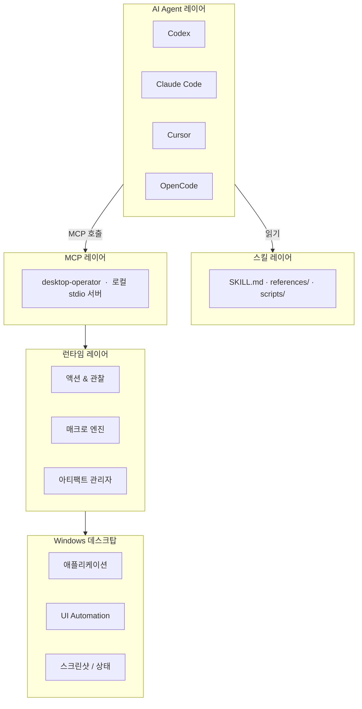

<div align="center">


<br/>

[](https://github.com/Marways7/cua_desktop_operator_skill)

<br/>


<br/>

[](#)
[](#)
[](#)
[](./LICENSE)
[](#)

<br/>

<p>
  <a href="./README.md"></a>
  <a href="./README.zh-CN.md"></a>
  <a href="./README.zh-Hant.md"></a>
  <a href="./README.ja.md"></a>
  <a href="./README.ko.md"></a>
</p>

</div>

---

## 프로젝트 소개

`CUA Desktop Operator Skill`은 MCP를 지원하는 모든 AI Agent에게 구조화된 Windows 데스크탑 조작 능력을 제공하는 **독립적인 클론 즉시 사용 가능한 스킬 저장소**입니다.

저장소의 루트 디렉토리**가** 스킬 패키지입니다——Agent의 skills 디렉토리에 클론하면 바로 사용할 수 있습니다.

```
agent（Codex / Claude Code / Cursor / OpenCode / ...）
    └─► MCP 클라이언트
            └─► desktop-operator（로컬 stdio 서버, 이 저장소）
                     └─► Windows 데스크탑
```

---

## 왜 이 프로젝트가 필요한가

대부분의 데스크탑 자동화 스택은 두 가지 극단 중 하나에 해당합니다:

| 접근 방식 | 문제점 |
|---|---|
| 취약한 스크립트 | 구조화된 관찰 모델이 없음; UI가 조금만 변경되어도 작동하지 않음 |
| 중량급 Agent 시스템 | 고정된 모델 백엔드, 클라우드 플래너, 또는 독점 비주얼 스택에 의존 |

**CUA Desktop Operator는 다른 접근 방식을 취합니다:**

| 설계 원칙 | 의미 |
|---|---|
| 추론은 Agent에 남겨둠 | AI 모델이 판단하고, 이 스킬은 실행만 함 |
| 실행은 로컬에 남겨둠 | 클라우드 왕복 없음, 외부 비주얼 모델 불필요 |
| 인터페이스는 통일 | MCP 도구는 모든 Agent에서 동일 |
| 스킬은 이식 가능 | 한 번 클론하면 Codex, Claude Code, Cursor 모두 사용 가능 |

결과적으로, 각 클라이언트를 위해 실행 레이어를 재구축하지 않고도 여러 AI 클라이언트에서 재사용할 수 있는 실용적인 데스크탑 오퍼레이터가 만들어집니다.

---

## 핵심 기능

<table>
<tr>
<td width="50%" valign="top">

### 데스크탑 제어
- 애플리케이션 실행
- 제목 또는 인덱스로 창 포커스
- 절대 좌표 또는 창 상대 좌표 클릭
- 단축키 및 키 시퀀스 전송
- 텍스트 입력 및 붙여넣기 (한국어/CJK용 클립보드 모드)
- 스크롤 및 명시적 대기

</td>
<td width="50%" valign="top">

### 관찰 우선 워크플로우
- 전체 화면 스크린샷 캡처
- 활성 창 감지
- 표시 중인 창 목록
- 대상 창 크롭 이미지
- 유계 UI Automation 쿼리
- 구조화된 JSON 상태 아티팩트

</td>
</tr>
<tr>
<td width="50%" valign="top">

### 재사용 가능한 매크로 레이어
- 앱 실행 (명령, URI, 단축키)
- 검색 박스 제출
- 채팅 패널 토글
- 미디어 재생/일시정지
- 브라우저 주소 표시줄 포커스
- Windows 설정 열기
- 제출/확인 작업

</td>
<td width="50%" valign="top">

### 크로스 Agent 인터페이스
- Codex
- Claude Code
- Cursor
- OpenCode
- 수동 stdio 설정을 통한 모든 MCP 호환 Agent
- Agent 중립: 동일한 도구, 동일한 결과, 모든 클라이언트

</td>
</tr>
</table>

---

## 아키텍처



### 각 레이어의 책임

| 레이어 | 역할 |
|---|---|
| **스킬 레이어** | 이 스킬을 언제 어떻게 사용할지 Agent에게 알려줌; 관찰→계획→실행→검증 루프 정의; 클라이언트 설정 안내 제공 |
| **MCP 레이어** | stdio를 통해 안정적인 버전 관리된 도구 인터페이스 노출; 모든 클라이언트에 일관된 결과 반환 |
| **런타임 레이어** | Win32 / UI Automation을 통해 실제 데스크탑 작업 수행; 스크린샷과 창 상태 캡처; 아티팩트 생명주기 관리 |

---

## 저장소 구조

```text
cua_desktop_operator_skill/
├── SKILL.md                          ← Agent가 먼저 읽는 파일
├── README.md                         ← 영어 문서
├── README.zh-CN.md                   ← 간체 중국어
├── README.zh-Hant.md                  ← 번체 중국어
├── README.ja.md                      ← 일본어
├── README.ko.md                      ← 한국어
├── LICENSE                           ← GNU AGPL v3.0
├── SECURITY.md
├── agents/
│   └── openai.yaml                   ← Agent 매니페스트（Codex / OpenCode）
├── references/
│   ├── compatibility.md              ← 크로스 Agent 호환성 노트
│   ├── failure-recovery.md           ← 장애 복구 패턴
│   ├── interaction-patterns.md       ← 인터랙션 모범 사례
│   ├── macro-catalog.md              ← 내장 매크로 참조
│   ├── mcp-client-setup.md           ← 클라이언트 설정 가이드
│   └── mcp-tool-catalog.md           ← 전체 MCP 도구 참조
├── scripts/
│   ├── setup_runtime.ps1             ← 의존성 설치
│   ├── start_mcp_server.ps1          ← MCP 서버 시작
│   ├── verify_real_tasks.ps1         ← 엔드투엔드 스킬 검증
│   └── verify_real_tasks.py
├── desktop_operator_core/            ← 런타임 라이브러리
└── desktop_operator_mcp/             ← MCP 서버 패키지
```

---

## 빠른 시작

### 1단계 — skills 디렉토리에 클론

```powershell
# Codex
git clone https://github.com/Marways7/cua_desktop_operator_skill "$HOME\.codex\skills\cua_desktop_operator_skill"

# Claude Code
git clone https://github.com/Marways7/cua_desktop_operator_skill "$HOME\.claude\skills\cua_desktop_operator_skill"

# Cursor
git clone https://github.com/Marways7/cua_desktop_operator_skill "$HOME\.cursor\skills\cua_desktop_operator_skill"
```

### 2단계 — 의존성 설치

```powershell
.\scripts\setup_runtime.ps1
```

### 3단계 — 로컬 MCP 서버 시작

```powershell
.\scripts\start_mcp_server.ps1
```

### 4단계 — Agent에게 SKILL.md를 읽게 하기

저장소 루트의 `SKILL.md`를 Agent에게 지시합니다. Agent는 해당 파일을 읽고 **자동으로 설정을 완료**합니다——사용 가능한 도구, 권장 워크플로우, 로컬 MCP 서버 연결 방법을 이해합니다.

수동 MCP 설정이 필요 없습니다. 스킬 파일 자체가 완전한 자기 설명 문서입니다.

---

## MCP 도구 참조

### 관찰 도구

| 도구 | 설명 |
|---|---|
| `desktop_observe` | 전체 스크린샷, 활성 창, 창 목록, 선택적 대상 창 크롭 이미지 및 JSON 상태 아티팩트 캡처 |
| `desktop_get_last_artifacts` | 최신 스크린샷, 상태, 실행 및 실패 아티팩트 경로 로드 |
| `desktop_cleanup_artifacts` | 작업 성공 완료 후 작업 범위 임시 파일 삭제 |

### 창 관리

| 도구 | 설명 |
|---|---|
| `desktop_list_windows` | 표시 중인 모든 창의 빠른 목록 |
| `desktop_find_window` | 제목 필터로 후보 창 검색 |
| `desktop_focus_window` | 키보드 조작 전에 창을 전면으로 가져오기 |
| `desktop_launch_app` | 셸 명령, 실행 파일, URI 또는 단축키 실행 |

### 기본 액션

| 도구 | 사용 시기 |
|---|---|
| `desktop_click_relative` | **권장** — 대상 창 기준 상대 위치 클릭 |
| `desktop_click_absolute` | 최후 수단 — 절대 화면 좌표 클릭 |
| `desktop_send_keys` | 단일 키 또는 단축키 시퀀스（`Ctrl+C`, `Alt+F4` 등） |
| `desktop_type_text` | 짧은 순수 ASCII 텍스트 |
| `desktop_paste_text` | **한국어/CJK 또는 긴 텍스트 권장** — 클립보드 기반 붙여넣기 |
| `desktop_scroll` | 포커스된 영역 스크롤 |
| `desktop_wait` | UI 로딩 중 명시적 대기 |

### UI Automation 도구

| 도구 | 설명 |
|---|---|
| `desktop_uia_query` | 선택적 선택자（텍스트, Automation ID, 컨트롤 유형）로 UIA 컨트롤 열거 |
| `desktop_uia_click` | 텍스트, Automation ID 또는 컨트롤 유형으로 UIA 컨트롤 클릭 |
| `desktop_uia_type` | UIA 컨트롤에 포커스하고 텍스트 입력 |

### 워크플로우 도구

| 도구 | 설명 |
|---|---|
| `desktop_run_macro` | 내장 매크로 실행; `macro_id="__catalog__"`으로 모든 매크로 목록 보기 |
| `desktop_validate_state` | 액션 후 창 또는 컨트롤 존재 여부 검증 |

전체 설명: [`references/mcp-tool-catalog.md`](./references/mcp-tool-catalog.md)

---

## 매크로 카탈로그

매크로는 안정적이고 재사용 가능한 GUI 조작 패턴을 캡슐화합니다. 알려진 플로우에는 기본 액션보다 매크로를 우선 사용하세요.

| 매크로 ID | 카테고리 | 목적 |
|---|---|---|
| `app_launch` | 앱 실행 | 명령, URI 또는 실행 파일로 앱 실행 |
| `desktop_shortcut_launch` | 앱 실행 | `.lnk` 단축키 경로로 실행 |
| `search_box_submit` | 검색 | 검색 박스 포커스, 쿼리 입력, 제출 |
| `chat_panel_toggle` | 채팅 | 단축키 또는 상대 클릭으로 채팅 패널 토글 |
| `media_play_pause` | 미디어 | 미디어 플레이어에 재생/일시정지 키 전송 |
| `browser_focus_address_bar` | 브라우저 | 단축키로 브라우저 주소 표시줄 포커스 |
| `submit_or_confirm` | 확인 | 제출/확인 키 시퀀스 누르기 |
| `open_windows_settings` | 설정 | Windows 설정 앱 열기 |

전체 설명: [`references/macro-catalog.md`](./references/macro-catalog.md)

---

## 설계 원칙

| 원칙 | 세부 사항 |
|---|---|
| **Agent 중립** | 하나의 실행 레이어, 여러 클라이언트——동일한 MCP 도구가 수정 없이 모든 Agent를 처리 |
| **로컬 우선** | 클라우드 플래너 불필요; 외부 비주얼 모델 불필요; 로컬 머신에서 완전히 실행 |
| **액션 전에 관찰** | 모든 인터랙션 루프는 `desktop_observe`로 시작; 맹목적으로 행동하지 않음 |
| **작고 안전한 단계** | 각 액션을 유계로 유지; 가역적 액션 우선; 변경 후 매번 검증 |
| **취약함보다 재사용** | 반복 가능한 패턴에는 매크로 사용; 필요할 때만 기본 액션으로 강등 |
| **기본 이식 가능** | 하드코딩된 머신 경로 없음; 사용자 프로파일 가정 없음; 저장소 로컬 아티팩트 의존성 없음 |

---

## Agent 권장 워크플로우

```
1.  desktop-operator MCP 서버가 연결되어 있는지 확인.
    └─ 미연결 시: references/mcp-client-setup.md를 따라 설정 후 진행.

2.  desktop_observe 호출.
    └─ 확인 사항: 스크린샷 경로, 활성 창, 표시 중인 창, 선택적 크롭 이미지.

3.  다음 우선순위로 최소한의 다음 액션 선택:
    desktop_focus_window            → 키보드 입력 전
    desktop_run_macro               → 인식된 재사용 가능한 패턴에
    desktop_click_relative          → 안정적인 창 상대 위치
    desktop_uia_click / uia_type    → 신뢰할 수 있는 UIA 컨트롤이 보일 때
    desktop_click_absolute          → 최후 수단

4.  액션 실행.

5.  desktop_observe 또는 desktop_validate_state 호출로 결과 확인.

6.  성공 조건이 충족될 때까지 2단계부터 반복.

7.  desktop_cleanup_artifacts 호출.
    └─ 사용자가 디버그 추적 보존을 명시적으로 요청한 경우에만 건너뜀.
```

---

## 아티팩트 관리

작업 스크린샷, JSON 상태 파일, 실행 로그는 기본적으로 **임시 아티팩트**로 처리됩니다.

| 속성 | 값 |
|---|---|
| 기본 저장 위치 | `%LOCALAPPDATA%\desktop-operator\artifacts`（Windows）/ 시스템 임시 디렉토리（폴백） |
| 범위 | 현재 작업 세션만 |
| 정리 | 작업 성공 후 Agent가 `desktop_cleanup_artifacts` 호출 |
| 재정의 | `DESKTOP_OPERATOR_ARTIFACTS` 환경 변수 설정 |

아티팩트는 저장소에 **커밋되지 않습니다**.

---

## 검증

내장 검증 스크립트를 실행하여 스킬이 엔드투엔드로 작동하는지 확인합니다:

```powershell
.\scripts\verify_real_tasks.ps1 --task observe
```

지원되는 검증 대상:

| 대상 | 테스트 내용 |
|---|---|
| `observe` | 스크린샷 캡처 및 창 감지 |
| `notepad` | 메모장 실행, 입력, 저장 |
| `browser` | 브라우저 주소 표시줄 및 탐색 |
| `settings` | Windows 설정 열기 |
| `media` | 매크로를 통한 미디어 재생/일시정지 |
| `chat` | 매크로를 통한 채팅 패널 토글 |
| `all` | 모든 대상을 순서대로 실행 |

검증 후 아티팩트를 보존하여 검사하려면:

```powershell
.\scripts\verify_real_tasks.ps1 --task all --keep-artifacts
```

---

## 감사의 말

이 프로젝트를 가능하게 해준 오픈소스 커뮤니티와 연구자들에게 깊은 감사를 드립니다. 특히:

- **[microsoft/cua_skill](https://github.com/microsoft/cua_skill)** — Computer Use Agent 스킬 개념과 구조화된 스킬 패키징 방식을 선도적으로 개척하여, 이 저장소의 설계에 깊은 영감을 주었습니다.
- **[bytedance/UI-TARS-desktop](https://github.com/bytedance/UI-TARS-desktop)** — GUI Agent 연구와 데스크탑 인터랙션 패턴에 관한 뛰어난 연구가 이 프로젝트의 '관찰 우선' 워크플로우 형성에 영향을 주었습니다.

---

## 라이선스

이 프로젝트는 [GNU Affero General Public License v3.0](./LICENSE)에 따라 배포됩니다.

AGPL을 사용하는 것은 재배포되거나 호스팅된 수정 버전이 동일한 라이선스 하에 계속 오픈 상태를 유지하도록 하기 위함입니다.

Copyright (C) 2026 Marways7 and contributors.

---

## Star 히스토리

이 프로젝트가 도움이 됐다면 GitHub에서 Star를 눌러 주세요.

[](https://star-history.com/#Marways7/cua_desktop_operator_skill&Date)


