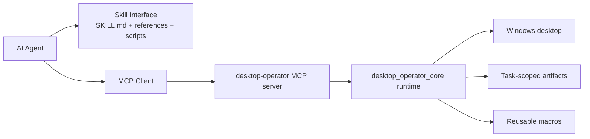

<div align="center">

# CUA Desktop Operator Skill

**A Windows-first, MCP-native desktop operation skill for Codex, Claude Code, Cursor, OpenCode, and other MCP-capable AI agents.**

[](#)
[](#)
[](#)
[](#)

<p>
  <a href="./README.md"></a>
  <a href="./README.zh-CN.md"></a>
  <a href="./README.ja.md"></a>
</p>

</div>

---

## What This Repository Is

`CUA Desktop Operator Skill` is a **standalone skill repository**. The repository root is the skill package.

It gives an AI agent a structured way to operate a Windows desktop through:

- a **local MCP server**
- a **shared desktop runtime**
- a **portable skill interface**
- a **bounded observe -> plan -> act -> verify loop**

This repository is designed so that you can clone it directly into a skills directory such as:

- `~/.codex/skills/cua_desktop_operator_skill`
- `~/.cursor/skills/cua_desktop_operator_skill`
- `~/.claude/skills/cua_desktop_operator_skill`
- another agent-specific skills directory that supports local MCP workflows

The repository no longer depends on machine-specific paths or repo-local runtime folders.

---

## Provenance

This project was shaped by studying public desktop-agent work, especially:

- [microsoft/cua_skill](https://github.com/microsoft/cua_skill)
- [bytedance/UI-TARS-desktop](https://github.com/bytedance/UI-TARS-desktop)

The released working tree is intended to contain this repository's own runtime, MCP server, and skill files rather than the original upstream source trees.

For publication hygiene, this repository should be published with its own clean history.

---

## Why This Exists

Most desktop automation stacks fall into one of two extremes:

1. brittle scripts with no structured observation model
2. heavyweight agent systems that assume a fixed model backend, cloud planner, or custom visual stack

This project takes a different path:

- keep **reasoning in the agent**
- keep **execution in a local runtime**
- expose that execution through **MCP**
- keep the skill **portable across agents**

The result is a practical desktop operator that can be reused by multiple AI clients without rebuilding the execution layer for each one.

---

## Key Capabilities

- **Windows-first desktop control**
  - launch apps
  - focus windows
  - click absolute or window-relative coordinates
  - send hotkeys
  - type and paste text
  - scroll and wait

- **Observation-first workflow**
  - screenshot capture
  - active window detection
  - visible window inventory
  - optional cropped target-window screenshots
  - bounded UI Automation queries

- **Reusable macro layer**
  - app launch
  - search box submit
  - chat panel toggle
  - media play/pause
  - browser address bar focus
  - Windows Settings open

- **Cross-agent interface**
  - Codex
  - Claude Code
  - Cursor
  - OpenCode
  - other MCP-capable agents through manual stdio server configuration

- **Portable runtime behavior**
  - no hardcoded user paths
  - no repo-local artifact dependency
  - task-scoped temporary artifacts
  - post-task cleanup support

---

## Architecture



### Layer responsibilities

**Skill layer**

- tells the agent when to use the skill
- defines the preferred workflow
- explains client setup when MCP is missing

**MCP layer**

- exposes a stable tool surface
- keeps the interface the same across clients
- returns structured results

**Runtime layer**

- performs real desktop actions
- captures observations
- handles bounded UIA access
- manages task artifacts and cleanup

---

## Repository Layout

```text
cua_desktop_operator_skill/
|- SKILL.md
|- README.md
|- README.zh-CN.md
|- README.ja.md
|- LICENSE
|- SECURITY.md
|- agents/
|  \- openai.yaml
|- references/
|  |- compatibility.md
|  |- failure-recovery.md
|  |- interaction-patterns.md
|  |- macro-catalog.md
|  |- mcp-client-setup.md
|  \- mcp-tool-catalog.md
|- scripts/
|  |- setup_runtime.ps1
|  |- start_mcp_server.ps1
|  |- verify_real_tasks.ps1
|  \- verify_real_tasks.py
|- desktop_operator_core/
\- desktop_operator_mcp/
```

---

## Quick Start

### 1. Clone the repository into your skills directory

Example:

```powershell
git clone https://github.com/Marways7/cua_desktop_operator_skill "$HOME\\.codex\\skills\\cua_desktop_operator_skill"
```

You can use the same pattern for Cursor, Claude Code, or another skills folder.

### 2. Install dependencies

From the repository root:

```powershell
.\scripts\setup_runtime.ps1
```

If you want to install the skill into another directory explicitly:

```powershell
.\scripts\setup_runtime.ps1 -InstallDir "$HOME\\.codex\\skills\\cua_desktop_operator_skill"
```

### 3. Start the local MCP server

```powershell
.\scripts\start_mcp_server.ps1
```

### 4. Add the MCP server to your agent

Read:

- [`references/mcp-client-setup.md`](./references/mcp-client-setup.md)

That file includes configuration guidance for:

- Codex
- Claude Code
- Cursor
- OpenCode
- a generic fallback payload for other MCP-capable agents

### 5. Let the agent use the skill

Once the MCP server is connected, the agent can:

1. observe the desktop
2. plan the next safe step
3. execute through MCP
4. verify the result
5. clean task artifacts when finished

---

## Core MCP Tools

### Observe

- `desktop_observe`
- `desktop_get_last_artifacts`
- `desktop_cleanup_artifacts`

### Windows

- `desktop_list_windows`
- `desktop_find_window`
- `desktop_focus_window`
- `desktop_launch_app`

### Primitive actions

- `desktop_click_absolute`
- `desktop_click_relative`
- `desktop_send_keys`
- `desktop_type_text`
- `desktop_paste_text`
- `desktop_scroll`
- `desktop_wait`

### UI Automation

- `desktop_uia_query`
- `desktop_uia_click`
- `desktop_uia_type`

### Workflow helpers

- `desktop_run_macro`
- `desktop_validate_state`

Detailed descriptions live in:

- [`references/mcp-tool-catalog.md`](./references/mcp-tool-catalog.md)

---

## Portability and Privacy

This repository is prepared for open-source distribution.

### What was removed

- hardcoded local Windows paths
- hardcoded user-profile references
- repo-local runtime output assumptions
- legacy upstream directories unrelated to the final skill package

### Artifact behavior

By default, task screenshots, JSON state files, and execution logs are treated as **temporary artifacts**.

- They are stored under a local OS-specific artifact directory.
- They are scoped to the current task session.
- Agents are expected to call `desktop_cleanup_artifacts` after task success unless the user asked to keep debug evidence.

Default artifact root:

- Windows: `%LOCALAPPDATA%\\desktop-operator\\artifacts`
- fallback: system temp directory

Optional override:

- `DESKTOP_OPERATOR_ARTIFACTS`

---

## Validation

The repository includes a local validation script:

```powershell
.\scripts\verify_real_tasks.ps1 --task observe
```

Supported validation targets:

- `observe`
- `notepad`
- `browser`
- `settings`
- `media`
- `chat`
- `all`

The validation script also supports automatic artifact cleanup after the run. Pass `--keep-artifacts` when you need to inspect the generated traces.

---

## Design Principles

- **Agent-neutral**
  - one execution layer, many clients

- **Local-first**
  - no required cloud planner
  - no required external visual model

- **Small safe steps**
  - observe first
  - act with bounded scope
  - verify after mutation

- **Reusable over brittle**
  - use macros when a pattern repeats
  - fall back to primitives when needed

- **Portable by default**
  - no machine-bound assumptions
  - no personal file paths in the distributed package

---

## Recommended Workflow for Agents

1. Check that the `desktop-operator` MCP server is connected.
2. If MCP is missing, configure it first using `references/mcp-client-setup.md`.
3. Call `desktop_observe`.
4. Choose the smallest next action.
5. Prefer window-relative clicks and UIA where stable.
6. Re-observe after each mutating step.
7. Once the task is complete, call `desktop_cleanup_artifacts` unless the user requested to keep the traces.

---

## License

This project is distributed under the terms of the [GNU Affero General Public License v3.0](./LICENSE).

AGPL is used here so that redistributed or hosted modified versions remain open under the same license.

---

## Star History

[](https://star-history.com/#Marways7/cua_desktop_operator_skill&Date)
