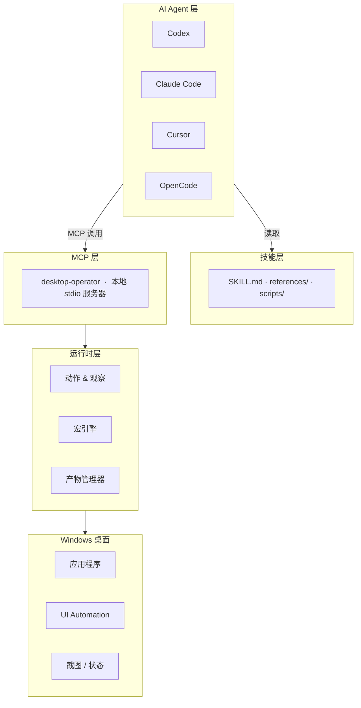

<div align="center">


<br/>

[](https://github.com/Marways7/cua_desktop_operator_skill)

<br/>


<br/>

[](#)
[](#)
[](#)
[](./LICENSE)
[](#)

<br/>

<p>
  <a href="./README.md"></a>
  <a href="./README.zh-CN.md"></a>
  <a href="./README.zh-Hant.md"></a>
  <a href="./README.ja.md"></a>
  <a href="./README.ko.md"></a>
</p>

</div>

---

## 项目简介

`CUA Desktop Operator Skill` 是一个**可直接克隆使用的独立技能仓库**，为任何支持 MCP 的 AI Agent 提供结构化的 Windows 桌面操作能力。

仓库根目录**即**技能包目录——克隆到 Agent 的 skills 目录后即可直接使用。

```
agent（Codex / Claude Code / Cursor / OpenCode / ...）
    └─► MCP 客户端
            └─► desktop-operator（本地 stdio 服务器，即本仓库）
                     └─► Windows 桌面
```

---

## 为什么需要这个项目

当前大多数桌面自动化方案要么太脆弱，要么过于沉重：

| 方案 | 问题 |
|---|---|
| 脆弱脚本 | 无结构化观察模型；UI 稍有变化即失效 |
| 重量级 Agent 系统 | 依赖固定模型后端、云端规划器或专有视觉模型 |

**CUA Desktop Operator 走了一条不同的路：**

| 设计原则 | 含义 |
|---|---|
| 推理留在 Agent 侧 | AI 模型负责决策，本技能只负责执行 |
| 执行留在本地 | 无云端往返，无外部视觉模型依赖 |
| 接口保持统一 | MCP 工具对所有 Agent 完全一致 |
| 技能保持可移植 | 克隆一次，Codex、Claude Code、Cursor 均可直接使用 |

最终结果：一套桌面执行能力，多个 AI 客户端共享，无需为每个客户端重新构建执行层。

---

## 核心能力

<table>
<tr>
<td width="50%" valign="top">

### 桌面控制
- 启动应用程序
- 按标题或索引聚焦窗口
- 绝对坐标或相对窗口坐标点击
- 发送热键和按键序列
- 输入与粘贴文本（剪贴板模式支持中文）
- 滚动与显式等待

</td>
<td width="50%" valign="top">

### 观察优先工作流
- 全屏截图捕获
- 当前活动窗口检测
- 可见窗口清单
- 目标窗口裁剪截图
- 有界 UI Automation 查询
- 结构化 JSON 状态产物

</td>
</tr>
<tr>
<td width="50%" valign="top">

### 可复用宏动作层
- 启动应用（命令、URI、快捷方式）
- 搜索框提交
- 聊天面板切换
- 媒体播放/暂停
- 浏览器地址栏聚焦
- 打开 Windows 设置
- 提交/确认操作

</td>
<td width="50%" valign="top">

### 跨 Agent 接口
- Codex
- Claude Code
- Cursor
- OpenCode
- 任何支持 MCP 的 Agent（通过手动配置 stdio）
- Agent 中立：相同工具，相同结果，任意客户端

</td>
</tr>
</table>

---

## 架构总览



### 各层职责

| 层级 | 职责 |
|---|---|
| **技能层** | 告知 Agent 何时及如何使用本技能；定义「观察 → 规划 → 执行 → 验证」循环；提供客户端配置说明 |
| **MCP 层** | 通过 stdio 暴露稳定、版本化的工具接口；向所有客户端返回结构一致的结果 |
| **运行时层** | 通过 Win32 / UI Automation 执行真实桌面操作；捕获截图和窗口状态；管理任务级产物生命周期 |

---

## 仓库结构

```text
cua_desktop_operator_skill/
├── SKILL.md                          ← Agent 首先读取此文件
├── README.md                         ← 英文文档
├── README.zh-CN.md                   ← 简体中文
├── README.zh-Hant.md                  ← 繁體中文
├── README.ja.md                      ← 日语
├── README.ko.md                      ← 韩语
├── LICENSE                           ← GNU AGPL v3.0
├── SECURITY.md
├── agents/
│   └── openai.yaml                   ← Agent 清单（Codex / OpenCode）
├── references/
│   ├── compatibility.md              ← 跨 Agent 兼容性说明
│   ├── failure-recovery.md           ← 故障恢复模式
│   ├── interaction-patterns.md       ← 交互最佳实践
│   ├── macro-catalog.md              ← 内置宏参考
│   ├── mcp-client-setup.md           ← 客户端配置指南
│   └── mcp-tool-catalog.md           ← 完整 MCP 工具参考
├── scripts/
│   ├── setup_runtime.ps1             ← 安装依赖
│   ├── start_mcp_server.ps1          ← 启动 MCP 服务器
│   ├── verify_real_tasks.ps1         ← 端到端技能验证
│   └── verify_real_tasks.py
├── desktop_operator_core/            ← 运行时库
└── desktop_operator_mcp/             ← MCP 服务器包
```

---

## 快速开始

### 第一步 — 克隆到 skills 目录

```powershell
# Codex
git clone https://github.com/Marways7/cua_desktop_operator_skill "$HOME\.codex\skills\cua_desktop_operator_skill"

# Claude Code
git clone https://github.com/Marways7/cua_desktop_operator_skill "$HOME\.claude\skills\cua_desktop_operator_skill"

# Cursor
git clone https://github.com/Marways7/cua_desktop_operator_skill "$HOME\.cursor\skills\cua_desktop_operator_skill"
```

### 第二步 — 安装依赖

```powershell
.\scripts\setup_runtime.ps1
```

### 第三步 — 启动本地 MCP 服务器

```powershell
.\scripts\start_mcp_server.ps1
```

### 第四步 — 让 Agent 读取 SKILL.md

将 Agent 指向仓库根目录的 `SKILL.md`，Agent 会读取该文件并**自动完成配置**——理解可用工具、推荐工作流以及如何连接到本地 MCP 服务器。

无需手动配置 MCP。技能文件本身即为完整的自描述文档。

---

## MCP 工具参考

### 观察工具

| 工具 | 说明 |
|---|---|
| `desktop_observe` | 捕获全屏截图、活动窗口、窗口列表、可选的目标窗口裁剪图及 JSON 状态产物 |
| `desktop_get_last_artifacts` | 加载最新的截图、状态、执行和失败产物路径 |
| `desktop_cleanup_artifacts` | 任务成功完成后删除任务级临时文件 |

### 窗口管理

| 工具 | 说明 |
|---|---|
| `desktop_list_windows` | 快速获取所有可见窗口清单 |
| `desktop_find_window` | 按标题过滤查找候选窗口 |
| `desktop_focus_window` | 在键盘交互前将窗口置于前台 |
| `desktop_launch_app` | 启动 shell 命令、可执行文件、URI 或快捷方式 |

### 原子动作

| 工具 | 适用场景 |
|---|---|
| `desktop_click_relative` | **首选** — 相对目标窗口的位置点击 |
| `desktop_click_absolute` | 最后手段 — 绝对屏幕坐标点击 |
| `desktop_send_keys` | 单键或热键序列（`Ctrl+C`、`Alt+F4` 等） |
| `desktop_type_text` | 短纯 ASCII 文本输入 |
| `desktop_paste_text` | **中文或长文本首选** — 剪贴板模式粘贴 |
| `desktop_scroll` | 滚动当前焦点区域 |
| `desktop_wait` | UI 加载时显式等待 |

### UI Automation 工具

| 工具 | 说明 |
|---|---|
| `desktop_uia_query` | 使用可选选择器（文本、Automation ID、控件类型）枚举 UIA 控件 |
| `desktop_uia_click` | 按文本、Automation ID 或控件类型点击 UIA 控件 |
| `desktop_uia_type` | 聚焦 UIA 控件并输入文本 |

### 工作流工具

| 工具 | 说明 |
|---|---|
| `desktop_run_macro` | 执行内置宏；使用 `macro_id="__catalog__"` 列出所有宏 |
| `desktop_validate_state` | 操作后验证窗口或控件是否存在 |

完整说明：[`references/mcp-tool-catalog.md`](./references/mcp-tool-catalog.md)

---

## 宏目录

宏封装了稳定的、可复用的 GUI 操作模式。对已知流程优先使用宏，而非原子操作。

| 宏 ID | 分类 | 用途 |
|---|---|---|
| `app_launch` | 应用启动 | 通过命令、URI 或可执行文件启动应用 |
| `desktop_shortcut_launch` | 应用启动 | 通过 `.lnk` 快捷方式路径启动 |
| `search_box_submit` | 搜索 | 聚焦搜索框、输入查询、提交 |
| `chat_panel_toggle` | 聊天 | 通过热键或相对点击切换聊天面板 |
| `media_play_pause` | 媒体 | 向媒体播放器发送播放/暂停键 |
| `browser_focus_address_bar` | 浏览器 | 通过快捷键聚焦浏览器地址栏 |
| `submit_or_confirm` | 确认 | 按下提交/确认按键序列 |
| `open_windows_settings` | 系统设置 | 打开 Windows 设置应用 |

完整说明：[`references/macro-catalog.md`](./references/macro-catalog.md)

---

## 设计原则

| 原则 | 详情 |
|---|---|
| **Agent 中立** | 一套执行层，多个客户端——相同的 MCP 工具服务于所有 Agent，无需修改 |
| **本地优先** | 不需要云端规划器；不需要外部视觉模型；完全在本地机器上运行 |
| **观察先于行动** | 每个交互循环都从 `desktop_observe` 开始；绝不盲目操作 |
| **小步安全操作** | 保持每个动作有界；优先可逆操作；每次变更后验证 |
| **可复用优先于脆弱** | 对可重复模式使用宏；仅在必要时降级为原子操作 |
| **默认可移植** | 无硬编码机器路径；无用户配置文件假设；无仓库本地产物依赖 |

---

## Agent 推荐工作流

```
1.  确认 desktop-operator MCP 服务器已连接。
    └─ 若未连接：先按 references/mcp-client-setup.md 配置后再继续。

2.  调用 desktop_observe。
    └─ 检查：截图路径、活动窗口、可见窗口、可选裁剪图。

3.  按以下优先级选择下一步最小操作：
    desktop_focus_window            → 键盘输入前
    desktop_run_macro               → 任何已识别的可复用模式
    desktop_click_relative          → 稳定的窗口相对位置
    desktop_uia_click / uia_type    → 可见可靠 UIA 控件时
    desktop_click_absolute          → 最后手段

4.  执行操作。

5.  调用 desktop_observe 或 desktop_validate_state 确认结果。

6.  从第 2 步重复，直至满足成功条件。

7.  调用 desktop_cleanup_artifacts。
    └─ 仅当用户明确要求保留调试痕迹时跳过。
```

---

## 产物管理

任务截图、JSON 状态文件和执行日志默认作为**临时产物**处理。

| 属性 | 值 |
|---|---|
| 默认存储位置 | `%LOCALAPPDATA%\desktop-operator\artifacts`（Windows）/ 系统临时目录（备用） |
| 作用域 | 仅限当前任务会话 |
| 清理方式 | 任务成功后 Agent 调用 `desktop_cleanup_artifacts` |
| 自定义路径 | 设置 `DESKTOP_OPERATOR_ARTIFACTS` 环境变量 |

产物**永远不会**被提交回仓库。

---

## 验证

运行内置验证脚本确认技能端到端正常工作：

```powershell
.\scripts\verify_real_tasks.ps1 --task observe
```

支持的验证目标：

| 目标 | 测试内容 |
|---|---|
| `observe` | 截图捕获与窗口检测 |
| `notepad` | 启动记事本、输入、保存 |
| `browser` | 浏览器地址栏与导航 |
| `settings` | 打开 Windows 设置 |
| `media` | 通过宏控制媒体播放/暂停 |
| `chat` | 通过宏切换聊天面板 |
| `all` | 按顺序运行所有目标 |

保留产物以供检查：

```powershell
.\scripts\verify_real_tasks.ps1 --task all --keep-artifacts
```

---

## 致谢

感谢开源社区和相关研究者的卓越工作，使本项目得以实现。特别感谢：

- **[microsoft/cua_skill](https://github.com/microsoft/cua_skill)** — 开创了 Computer Use Agent 技能概念及结构化技能打包方式，深刻启发了本仓库的设计思路。
- **[bytedance/UI-TARS-desktop](https://github.com/bytedance/UI-TARS-desktop)** — 在 GUI Agent 研究和桌面交互模式方面的出色工作，影响了本项目「观察优先」工作流的形成。

---

## 许可证

本项目基于 [GNU Affero General Public License v3.0](./LICENSE) 发布。

使用 AGPL 是为了确保分发或托管的修改版本在相同许可证下继续保持开放。

Copyright (C) 2026 Marways7 及贡献者。

---

## Star 历史

如果这个项目对你有帮助，欢迎在 GitHub 上点一个 Star。

[](https://star-history.com/#Marways7/cua_desktop_operator_skill&Date)


