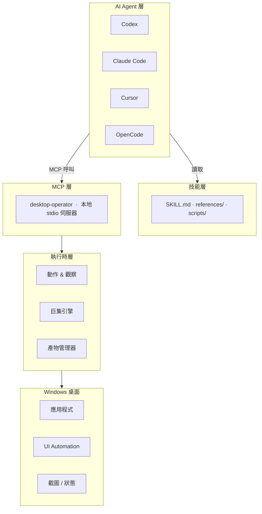

<div align="center">


<br/>

[](https://github.com/Marways7/cua_desktop_operator_skill)

<br/>


<br/>

[](#)
[](#)
[](#)
[](./LICENSE)
[](#)

<br/>

<p>
  <a href="./README.md"></a>
  <a href="./README.zh-CN.md"></a>
  <a href="./README.zh-Hant.md"></a>
  <a href="./README.ja.md"></a>
  <a href="./README.ko.md"></a>
</p>

</div>

---

## 專案簡介

`CUA Desktop Operator Skill` 是一個**可直接複製使用的獨立技能倉庫**，為任何支援 MCP 的 AI Agent 提供結構化的 Windows 桌面操作能力。

倉庫根目錄**即**技能套件目錄——複製到 Agent 的 skills 目錄後即可直接使用。

```
agent（Codex / Claude Code / Cursor / OpenCode / ...）
    └─► MCP 客戶端
            └─► desktop-operator（本地 stdio 伺服器，即本倉庫）
                     └─► Windows 桌面
```

---

## 為什麼需要這個專案

目前大多數桌面自動化方案要麼太脆弱，要麼過於笨重：

| 方案 | 問題 |
|---|---|
| 脆弱腳本 | 無結構化觀察模型；UI 稍有變化即失效 |
| 重量級 Agent 系統 | 依賴固定模型後端、雲端規劃器或專有視覺模型 |

**CUA Desktop Operator 走了一條不同的路：**

| 設計原則 | 含義 |
|---|---|
| 推理留在 Agent 端 | AI 模型負責決策，本技能只負責執行 |
| 執行留在本地 | 無雲端往返，無外部視覺模型依賴 |
| 介面保持統一 | MCP 工具對所有 Agent 完全一致 |
| 技能保持可攜性 | 複製一次，Codex、Claude Code、Cursor 均可直接使用 |

最終成果：一套桌面執行能力，多個 AI 客戶端共享，無需為每個客戶端重新建構執行層。

---

## 核心能力

<table>
<tr>
<td width="50%" valign="top">

### 桌面控制
- 啟動應用程式
- 依標題或索引聚焦視窗
- 絕對座標或相對視窗座標點擊
- 傳送熱鍵與按鍵序列
- 輸入與貼上文字（剪貼簿模式支援中文）
- 捲動與顯式等待

</td>
<td width="50%" valign="top">

### 觀察優先工作流
- 全螢幕截圖擷取
- 目前使用中視窗偵測
- 可見視窗清單
- 目標視窗裁切截圖
- 有界 UI Automation 查詢
- 結構化 JSON 狀態產物

</td>
</tr>
<tr>
<td width="50%" valign="top">

### 可複用巨集動作層
- 啟動應用（命令、URI、捷徑）
- 搜尋框提交
- 聊天面板切換
- 媒體播放/暫停
- 瀏覽器網址列聚焦
- 開啟 Windows 設定
- 提交/確認操作

</td>
<td width="50%" valign="top">

### 跨 Agent 介面
- Codex
- Claude Code
- Cursor
- OpenCode
- 任何支援 MCP 的 Agent（透過手動設定 stdio）
- Agent 中立：相同工具，相同結果，任意客戶端

</td>
</tr>
</table>

---

## 架構總覽



### 各層職責

| 層級 | 職責 |
|---|---|
| **技能層** | 告知 Agent 何時及如何使用本技能；定義「觀察 → 規劃 → 執行 → 驗證」循環；提供客戶端設定說明 |
| **MCP 層** | 透過 stdio 公開穩定、版本化的工具介面；向所有客戶端回傳結構一致的結果 |
| **執行時層** | 透過 Win32 / UI Automation 執行真實桌面操作；擷取截圖和視窗狀態；管理任務級產物生命週期 |

---

## 倉庫結構

```text
cua_desktop_operator_skill/
├── SKILL.md                          ← Agent 首先讀取此檔案
├── README.md                         ← 英文文件
├── README.zh-CN.md                   ← 簡體中文
├── README.zh-Hant.md                  ← 繁體中文
├── README.ja.md                      ← 日語
├── README.ko.md                      ← 韓語
├── LICENSE                           ← GNU AGPL v3.0
├── SECURITY.md
├── agents/
│   └── openai.yaml                   ← Agent 清單（Codex / OpenCode）
├── references/
│   ├── compatibility.md              ← 跨 Agent 相容性說明
│   ├── failure-recovery.md           ← 故障恢復模式
│   ├── interaction-patterns.md       ← 互動最佳實踐
│   ├── macro-catalog.md              ← 內建巨集參考
│   ├── mcp-client-setup.md           ← 客戶端設定指南
│   └── mcp-tool-catalog.md           ← 完整 MCP 工具參考
├── scripts/
│   ├── setup_runtime.ps1             ← 安裝依賴
│   ├── start_mcp_server.ps1          ← 啟動 MCP 伺服器
│   ├── verify_real_tasks.ps1         ← 端對端技能驗證
│   └── verify_real_tasks.py
├── desktop_operator_core/            ← 執行時程式庫
└── desktop_operator_mcp/             ← MCP 伺服器套件
```

---

## 快速開始

### 第一步 — 複製到 skills 目錄

```powershell
# Codex
git clone https://github.com/Marways7/cua_desktop_operator_skill "$HOME\.codex\skills\cua_desktop_operator_skill"

# Claude Code
git clone https://github.com/Marways7/cua_desktop_operator_skill "$HOME\.claude\skills\cua_desktop_operator_skill"

# Cursor
git clone https://github.com/Marways7/cua_desktop_operator_skill "$HOME\.cursor\skills\cua_desktop_operator_skill"
```

### 第二步 — 安裝依賴

```powershell
.\scripts\setup_runtime.ps1
```

### 第三步 — 啟動本地 MCP 伺服器

```powershell
.\scripts\start_mcp_server.ps1
```

### 第四步 — 讓 Agent 讀取 SKILL.md

將 Agent 指向倉庫根目錄的 `SKILL.md`，Agent 會讀取該檔案並**自動完成配置**——理解可用工具、推薦工作流以及如何連線到本地 MCP 伺服器。

無需手動配置 MCP。技能檔案本身即為完整的自描述文件。

---

## MCP 工具參考

### 觀察工具

| 工具 | 說明 |
|---|---|
| `desktop_observe` | 擷取全螢幕截圖、使用中視窗、視窗清單、可選的目標視窗裁切圖及 JSON 狀態產物 |
| `desktop_get_last_artifacts` | 載入最新的截圖、狀態、執行和失敗產物路徑 |
| `desktop_cleanup_artifacts` | 任務成功完成後刪除任務級臨時檔案 |

### 視窗管理

| 工具 | 說明 |
|---|---|
| `desktop_list_windows` | 快速取得所有可見視窗清單 |
| `desktop_find_window` | 依標題篩選查找候選視窗 |
| `desktop_focus_window` | 鍵盤互動前將視窗置於前台 |
| `desktop_launch_app` | 啟動 shell 命令、可執行檔、URI 或捷徑 |

### 原子動作

| 工具 | 適用場景 |
|---|---|
| `desktop_click_relative` | **首選** — 相對目標視窗的位置點擊 |
| `desktop_click_absolute` | 最後手段 — 絕對螢幕座標點擊 |
| `desktop_send_keys` | 單鍵或熱鍵序列（`Ctrl+C`、`Alt+F4` 等） |
| `desktop_type_text` | 短純 ASCII 文字輸入 |
| `desktop_paste_text` | **中文或長文字首選** — 剪貼簿模式貼上 |
| `desktop_scroll` | 捲動目前焦點區域 |
| `desktop_wait` | UI 載入時顯式等待 |

### UI Automation 工具

| 工具 | 說明 |
|---|---|
| `desktop_uia_query` | 使用可選選擇器（文字、Automation ID、控制項類型）列舉 UIA 控制項 |
| `desktop_uia_click` | 依文字、Automation ID 或控制項類型點擊 UIA 控制項 |
| `desktop_uia_type` | 聚焦 UIA 控制項並輸入文字 |

### 工作流工具

| 工具 | 說明 |
|---|---|
| `desktop_run_macro` | 執行內建巨集；使用 `macro_id="__catalog__"` 列出所有巨集 |
| `desktop_validate_state` | 操作後驗證視窗或控制項是否存在 |

完整說明：[`references/mcp-tool-catalog.md`](./references/mcp-tool-catalog.md)

---

## 巨集目錄

巨集封裝了穩定的、可複用的 GUI 操作模式。對已知流程優先使用巨集，而非原子操作。

| 巨集 ID | 分類 | 用途 |
|---|---|---|
| `app_launch` | 應用啟動 | 透過命令、URI 或可執行檔啟動應用 |
| `desktop_shortcut_launch` | 應用啟動 | 透過 `.lnk` 捷徑路徑啟動 |
| `search_box_submit` | 搜尋 | 聚焦搜尋框、輸入查詢、提交 |
| `chat_panel_toggle` | 聊天 | 透過熱鍵或相對點擊切換聊天面板 |
| `media_play_pause` | 媒體 | 向媒體播放器傳送播放/暫停鍵 |
| `browser_focus_address_bar` | 瀏覽器 | 透過快捷鍵聚焦瀏覽器網址列 |
| `submit_or_confirm` | 確認 | 按下提交/確認按鍵序列 |
| `open_windows_settings` | 系統設定 | 開啟 Windows 設定應用 |

完整說明：[`references/macro-catalog.md`](./references/macro-catalog.md)

---

## 設計原則

| 原則 | 詳情 |
|---|---|
| **Agent 中立** | 一套執行層，多個客戶端——相同的 MCP 工具服務於所有 Agent，無需修改 |
| **本地優先** | 不需要雲端規劃器；不需要外部視覺模型；完全在本地機器上執行 |
| **觀察先於行動** | 每個互動循環都從 `desktop_observe` 開始；絕不盲目操作 |
| **小步安全操作** | 保持每個動作有界；優先可逆操作；每次變更後驗證 |
| **可複用優先於脆弱** | 對可重複模式使用巨集；僅在必要時降級為原子操作 |
| **預設可攜性** | 無硬式編碼機器路徑；無使用者設定檔假設；無倉庫本地產物依賴 |

---

## Agent 推薦工作流

```
1.  確認 desktop-operator MCP 伺服器已連線。
    └─ 若未連線：先按 references/mcp-client-setup.md 設定後再繼續。

2.  呼叫 desktop_observe。
    └─ 檢查：截圖路徑、使用中視窗、可見視窗、可選裁切圖。

3.  依以下優先順序選擇下一步最小操作：
    desktop_focus_window            → 鍵盤輸入前
    desktop_run_macro               → 任何已識別的可複用模式
    desktop_click_relative          → 穩定的視窗相對位置
    desktop_uia_click / uia_type    → 可見可靠 UIA 控制項時
    desktop_click_absolute          → 最後手段

4.  執行操作。

5.  呼叫 desktop_observe 或 desktop_validate_state 確認結果。

6.  從第 2 步重複，直至滿足成功條件。

7.  呼叫 desktop_cleanup_artifacts。
    └─ 僅當使用者明確要求保留除錯痕跡時跳過。
```

---

## 產物管理

任務截圖、JSON 狀態檔案和執行日誌預設作為**臨時產物**處理。

| 屬性 | 值 |
|---|---|
| 預設儲存位置 | `%LOCALAPPDATA%\desktop-operator\artifacts`（Windows）/ 系統臨時目錄（備用） |
| 作用域 | 僅限目前任務工作階段 |
| 清理方式 | 任務成功後 Agent 呼叫 `desktop_cleanup_artifacts` |
| 自訂路徑 | 設定 `DESKTOP_OPERATOR_ARTIFACTS` 環境變數 |

產物**永遠不會**被提交回倉庫。

---

## 驗證

執行內建驗證腳本確認技能端對端正常運作：

```powershell
.\scripts\verify_real_tasks.ps1 --task observe
```

支援的驗證目標：

| 目標 | 測試內容 |
|---|---|
| `observe` | 截圖擷取與視窗偵測 |
| `notepad` | 啟動記事本、輸入、儲存 |
| `browser` | 瀏覽器網址列與導覽 |
| `settings` | 開啟 Windows 設定 |
| `media` | 透過巨集控制媒體播放/暫停 |
| `chat` | 透過巨集切換聊天面板 |
| `all` | 依序執行所有目標 |

保留產物以供檢查：

```powershell
.\scripts\verify_real_tasks.ps1 --task all --keep-artifacts
```

---

## 致謝

感謝開源社群和相關研究者的卓越工作，使本專案得以實現。特別感謝：

- **[microsoft/cua_skill](https://github.com/microsoft/cua_skill)** — 開創了 Computer Use Agent 技能概念及結構化技能打包方式，深刻啟發了本倉庫的設計思路。
- **[bytedance/UI-TARS-desktop](https://github.com/bytedance/UI-TARS-desktop)** — 在 GUI Agent 研究和桌面互動模式方面的出色工作，影響了本專案「觀察優先」工作流的形成。

---

## 授權條款

本專案基於 [GNU Affero General Public License v3.0](./LICENSE) 發布。

使用 AGPL 是為了確保散布或託管的修改版本在相同授權條款下繼續保持開放。

Copyright (C) 2026 Marways7 及貢獻者。

---

## Star 歷史

如果這個專案對你有幫助，歡迎在 GitHub 上點一個 Star。

[](https://star-history.com/#Marways7/cua_desktop_operator_skill&Date)


